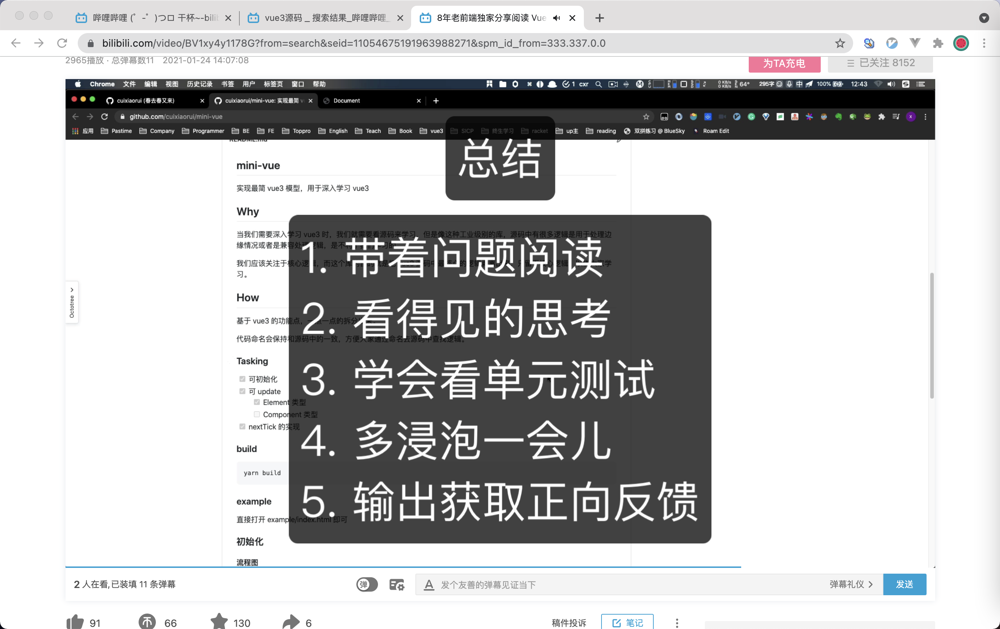
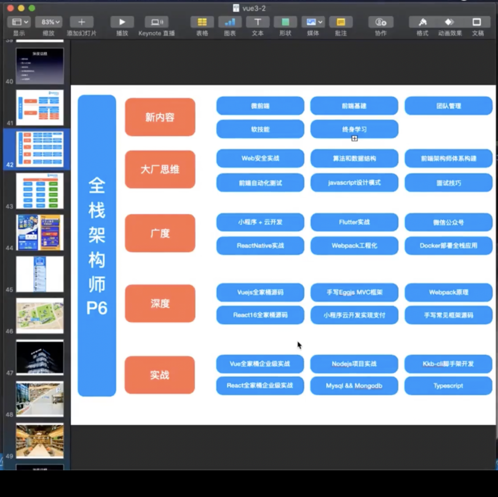

# jm-perception

#### 介绍

个人感悟，日记

### 想成为一个架构师： 就要把思路放在架构师点角度去想问题，不能局限于开发工程师

### 一个项目怎么做才算亮点

1. 把数据量想的贼大
2. 把网络想的巨卡无比，什么 1kb
3. 把用户想的贼笨

如果一个需求，都不能被以上这种困难问题难住，那么这就是你项目的核心亮点

### 读书

大神每天都是在读书，每一个赚钱的知识点都是很难获取的，所以要多去读对应的书籍

提醒 ⏰： 读书不要死读书，读书要做总结，要知道书讲了什么，你收获了那些东西

### 如何快乐

### 个人的计划

1. 下一步的计划 做全栈的架构师

### 理性消费的 4 问

当我看上了一款手机

1. 为什么心动
2. 为什么需要
3. 假设我是在采购部门，员工跟我提出，需要买某某产品，对比性价比，为什么是现在买，而不是等到最低价买
4. 为什么选这个品牌，而不是另一个品牌，横向对比，价格相同比性能，性能相同比价格

如果同时看中了多件商品，挑出最值得购买的商品逻辑：

1. 资金占用程度
2. 产品的附加值
3. 是否特别需要，是否急用
4. 需求满足的感是否最大
5. 出手二手价格价值最大

### 面试时问你期望薪资

最好的回答：市场薪资范围 + 公司情况 + 自身价值 + 10% 的溢价
12k + ? + 1k + 1k

- 反问面试官的一些问题

1. 哪些地方需要进步和学习

**4 个误区 和 2 个建议**

- 4 个误区
  - 薪水要的太高，薪水取决于面试官对你的评价，你可以在进去帮助面试官解决什么问题，才是重点
  - 不能因为想去这家公司，而选择降薪，因为，你的性价比高的公司，这家公司的规模一般比较小，大公司一般是看人
  - 入职薪水要的更低一些，等入职之后再来证明自己的能力
  - 并不是接了一个公司的 offer 就一定要去一个公司
- 2 个建议
  - 跳槽一定要有一个跳槽的理由
  - 平均跳槽的周期为 2 年 一跳

### 个人感悟

- 人最容易犯的错误是对自己宽容，对他人苛刻，如果能够反过来，生活空间会豁然开朗。

- 学习，学习的是什么？ 是思想，是解决想法，get 思路。绝对不是代码

- 难理解的，才是值钱的

### 面试学习法

渣男面试技能法

- 如何去阅读源码？
  

- 学习技能树
  

- 怎么去学习？
  - 做任务学习法
    - 以 vue3 来看待，主线任务，精通 vue3 源码的 原理，支线任务，遇到不会的代码和知识点，把支线任务做完，在回来做主线任务

### 关于学习

1. 看视频学习，不能只看不实战，实战会能学到东西
2. 费曼学习法：假定我学习这个知识，明天要参加演讲。要口述给他人，让他人理解我说的
3. 算法好的人，学什么都快，做大佬，就得学
