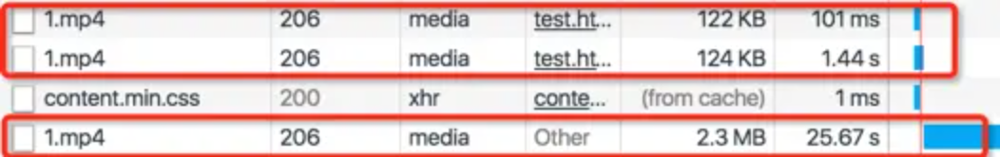

```html
<!DOCTYPE html>
<html>
  <head>
    <meta charset="UTF-8" />
    <title></title>
  </head>
  <body>
    <video src="./1.mp4" controls width="500px"></video>
  </body>
</html>
```
如上代码，页面中有一个video标签，未设置视频的自动播放，在页面打开时该视频的请求如下：




可以看见会分出3个HTTP状态码为206的请求，此时点击播放，最底下的请求继续接收数据，直到视频全部加载，

假设最底下的请求是视频数据流，那么前两个请包含什么内容？有方法去掉或者压缩吗？

给video设置poster属性为其指定一个缩略图，在页面打开时仍旧是三个media请求，所以和缩略图应该没有关系。


## 答


1. 请求视频这类文件的时候因为响应会很大，如果全部下载下来再播放会等待很长时间，用户体验不好，所以服务器会允许浏览器使用range头来请求视频的某一部分，并设置以206的响应码进行响应，来使浏览器可以边播放边请求，优化用户体验。所以会出现状态码为206的响应。

2. 另一方面，浏览器只有在获取到视频的元信息（metadata）后才开始播放视频，而一般不经过优化的视频，其元数据信息存在视频文件末尾。所以会出现连续三个请求的情况：第一个请求是先从0字节找视频的元数据信息，没找到的话，会继续发起一个请求到视频末尾去找，等找到以后，又会重新开始一个请求从视频开头处开始请求，此时视频才开始播放。如果视频经过优化，元数据信息在视频开头，就只会有一个请求了，所以推荐使用HandBrake这类的工具对视频经过网络优化后再上传。


[从天猫某活动视频不必要的3次请求说起](https://www.zhangxinxu.com/wordpress/2018/12/video-moov-box/)