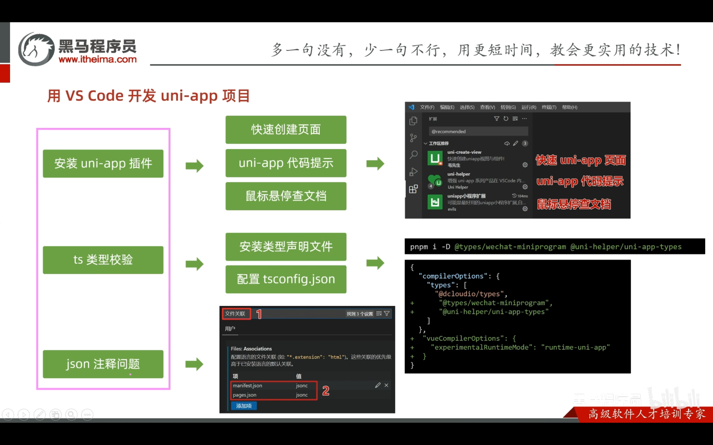
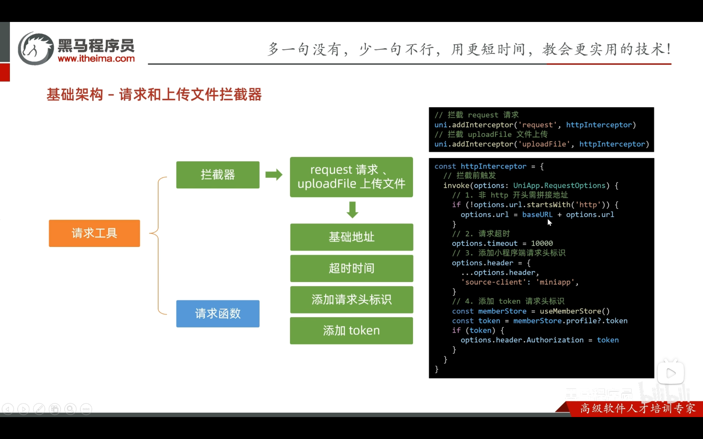
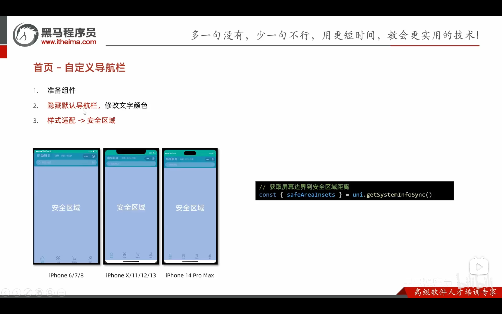

[vue-cli 创建开发环境](https://uniapp.dcloud.net.cn/quickstart-cli.html#%E5%88%9B%E5%BB%BAuni-app)

我们可以根据文档 指定的命令去 创建一个开发环境，或者，使用 gitee 上的仓库

1. 安装依赖 

npm i 

2. 运行到h5/微信小程序

npm run dev:h5

or 

npm run dev:mp-weixin

我们每次改动，终端都会监听编译为最新的代码，无论你是通过小程序开发者工具 打开的 还是 直接通过浏览器运行 h5 都能实时看到效果

### vsode 中 开发 uni-app

1. 安装插件
2. ts 类型校验
3. json 注释问题

### uni-app 中的 拦截器

### uni-app 安全区域

### uni-app 自定义导航

小程序/app 状态栏高度
- uni.getSystemInfo().statusBarHeight

小程序/app 胶囊菜单按钮的布局信息

- uni.getMenuButtonBoundingClientRect()
  - top 是胶囊按钮上边到顶部的距离
  - bottom 是胶囊按钮下边到顶部的距离
  - height 胶囊按钮的高度

胶囊按钮上下两边都有 一定的间距，可以使用  

1. `top - 小程序状态栏的高度 = 间距高度`  
2. `间距高度 * 2 + height = 胶囊菜单按钮的布局信息高度`
3. 自定义导航栏 定位样式下 `填充区域的高度 = 状态栏高度 + 胶囊菜单按钮的布局信息高度`