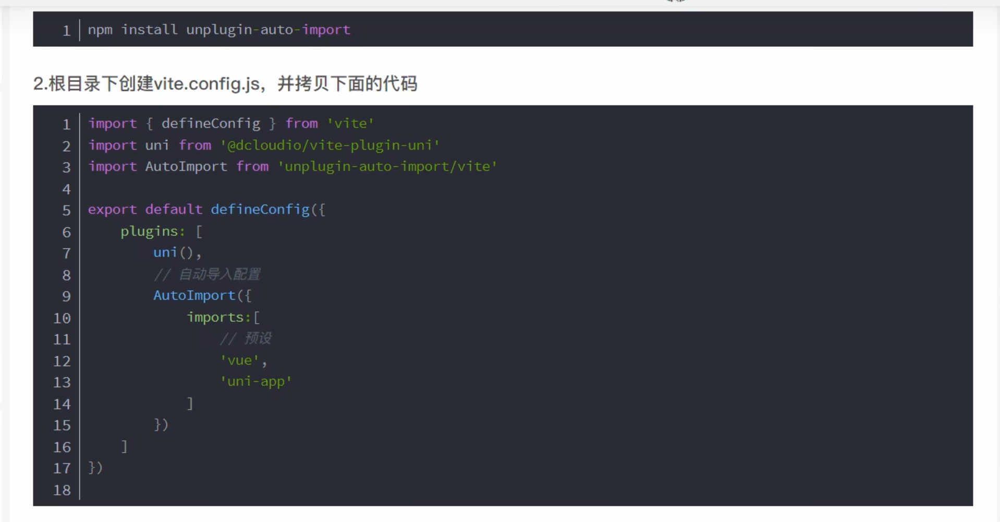

## uni-app 导入 生命周期钩子

[uni-app](https://uniapp.dcloud.net.cn/tutorial/vue-composition-api.html#%E4%BD%BF%E7%94%A8%E7%BB%84%E5%90%88%E5%BC%8Fapi)

- 自动导入

## 小程序页面生命周期和vue3组件生命周期对比

1. setup === onLoad === create, beforeCreate

2. onMounted === onReady

## 组件生命周期

## 页面生命周期

1. onLoad 

回调函数内部的参数，是query 参数传递过来的值

2. onReady 

等同于 mounted 没有参数

3. onshow

页面显示生命周期钩子

4. onHide

页面退出生命周期钩子

5. onUnload

页面卸载生命周期钩子

### 页面生命周期执行顺序

onLoad --》 onshow --》 onReady

