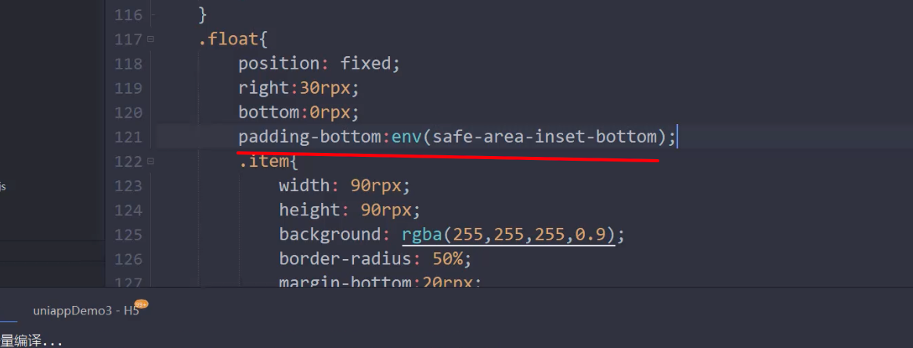

[即刻设计](https://js.design/community?category=explore)

丰富的UI资源，进行前端开发

## uni适配

小程序默认是 750rpx 

如果你的设计图是750的 直接写就是如果你的设计稿不是 750 ，可以使用 即刻设计的 等比例缩放将设计稿 调整为对应尺寸下开发即可

## 小程序安全区域

内容里面的环境变量可以撑开一段安全区域，比如 你定位的元素被 tabbar 遮挡住了， 可以通过这个办法。

## uni 扩展组件

相当于 element-ui 这种，需要安装下载使用，可以通过 uni-app 官网的扩展插件中进行下载