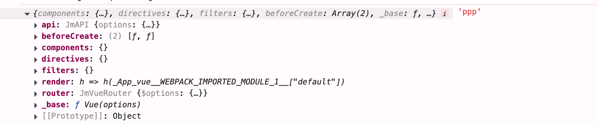
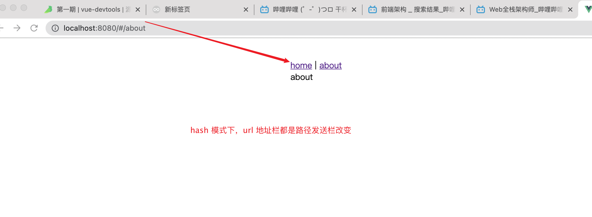

vue-router 插件在 vue 中的使用

```js
// routes.js 文件
import Vue from "vue";
import VueRouter from "vue-router";

Vue.use(VueRouter);

// 定义 routes

const routes = [
  {
    name: "home",
    path: "/",
    component: () => import(/* home */ "./home.vue").then((v) => v.default),
  },
  {
    name: "about",
    path: "/about",
    component: () => import(/* about */ "./about.vue").then((v) => v.default),
  },
];

// 暴露出去

export default new VueRouter({
  mode: "hash",
  routes,
});
```

```js
// main.js

import Vue from "vue";
import App from "./App.vue";

import router from "./routes.js";

Vue.config.productionTip = false;

new Vue({
  router, // 放置到vue 到options 里面去
  render: (h) => h(App),
}).$mount("#app");
```

### 1. 通过上面的用法，揣测下原理

1. vue.use() 是注册一个插件，那么久必须要 有 install 方法，这是 vue 官方内定的 , 不论你是 对象，还是 函数
2. new VueRouter(options), 中会传入 routes 路由表， 最后将实例化的 router 对象 暴露出去
3. 在根的 vue 实例上，传入 router

### 2. 开始建造自己的 router

1. 建立一个基本的插件基础

```js
let Vue = null; // 为什么要定义 变量去接收vue ,因为需要避免打包的时候，将 vue 也给进行打包进来

/**
 * options ：
 *  mode: 'hash // 路由模式
 *  routes // 路由表
 */
function JmVueRouter(options) {
  this.$options = options;
}

JmVueRouter.install = function (_Vue) {
  Vue = _Vue; // 缓存vue 实例
};

export default JmVueRouter;
```

2. Vue.mixin 注入 this.$router

使用 Vue.mixin 给 vue 的原型上添加 $router 指向 router 对象，vue 的子组件，会默认继承这些属性，
这也是你可以通哟 this.$router 去访问路由对象的原因

```js
// install 在 vue.use 的时候就已经被调用了
// beforeCreate 会在每一个组件被执行前置调用
// mixin 会给所有的 组件 安装上并执行一遍默认的生命周期
  Vue.mixin({
    beforeCreate() {
      // 在这里。this ?
      // 每次执行的this 都代表一个实例对象，从根实例一直往下 找
      if (this.$options.router) {
        Vue.prototype.$router = this.$options.router;
      }
    },
  });
```



可以看到，`this.$options` 可以获取到 根 的 options 对象, 将其设置在 原型上即可

3. 监听 url 变化，每次变跟，改变内部 的 current 值

```js
function JmVueRouter(options) {
  this.$options = options;

  this.current = "/";

  window.addEventListener("hashchange", () => {
    this.current = window.location.hash.slice(1);
  });
}
```

4. 建立 router-link , router-view 组件

```js
Vue.component("router-link", {
  props: {
    to: {
      type: String,
      required: true,
    },
  },
  render(h) {
    return h("a", { attrs: { href: "#" + this.to } }, this.$slots.default);
  },
});

Vue.component("router-view", {
  render(h) {
    return h(null);
  },
});
```

5. 可以看到我们的页面长这样子 ！



6. 思考 🤔？ 我们只需要，在 current 值发送改变，也就是 hashchange 事件执行后，去将 router-view 渲染的组件进行替换即可完成

   - 1. routes 路由表，从当前组件实例上的 $router.$options 上去拿到我们的路由表数组
   - 2. current 当前 current 从组件实例的 $router 上拿到
   - 3. 遍历路由表，将 component 找到，并通过 h 函数渲染

```js
Vue.component("router-view", {
  // 1. 拿到当前 current hash 路径
  // 2. 从路由表中找到对应的组件，渲染即可
  // 3. current 变化了，需要再次执行当前这个render函数, 将对应的组件渲染
  render(h) {
    const routers = this.$router.$options.routes || [];
    const current = this.$router.current || "/";
    const route = routers.find((item) => item.path === current) || null;
    return h(route.component);
  },
});
```

7. 组件渲染成功，发现切换路由，组件并没有，按需渲染

原因是因为，this.$router.current 的值，改变了，其他地方根本拿不到最新的值，所以，就需要，双向数据绑定 这个数据,
将 current 转变为一个响应式数据

```js
function JmVueRouter(options) {
  this.$options = options;

  // this.current = '/';

  const initValue = window.location.hash.slice(1) || "/";
  // 将 current 转变为一个响应式数据
  Vue.util.defineReactive(this, "current", initValue);

  window.addEventListener("hashchange", () => {
    this.current = window.location.hash.slice(1);
  });
}
```

8. Vue.util.defineReactive 是 vue 提供的将一个数据转变为响应式数据的工具方法

```js
Vue.util.defineReactive();
```

9. 完成 ✅，引发思考，如果路由表里面 有 children 属性该如何 处理？

1. 一开始的想法是，想把整个 routes 拉平成一维的，没有想到怎么写。(不失为一个想法)
1. 我的解决办法就是，使用递归，并且给递归加缓存

```js
let map = new Map();

function findComponent(routers, current) {
  if (!routers.length || !current) return;

  // 声明一个component， 将来是一个组件
  let component = null;
  // 缓存中读取
  if (map.get(current)) {
    console.log("拿到了缓存");
    return map.get(current);
  }

  console.log("这个组件没有缓存");
  // 没有被缓存，遍历
  for (let index = 0; index < routers.length; index++) {
    const item = routers[index];
    // 找到了，设置缓存，并直接返回
    if (current === item.path) {
      map.set(item.path, item.component);
      return item.component;
    }
    // 有 children 属性，再次递归查找
    if (item.children && item.children.length) {
      component = findComponent(item.children, current);
    }
  }
  // 返回 组件函数
  return component;
}
```


在这里我们可以看到，我们使用了 `Vue.util.defineReactive` 可以将数据转为响应式的方法，一旦current发生变更，`router-view` 的 render 函数中就会重新的渲染组件，这样就实现了一个基本原理